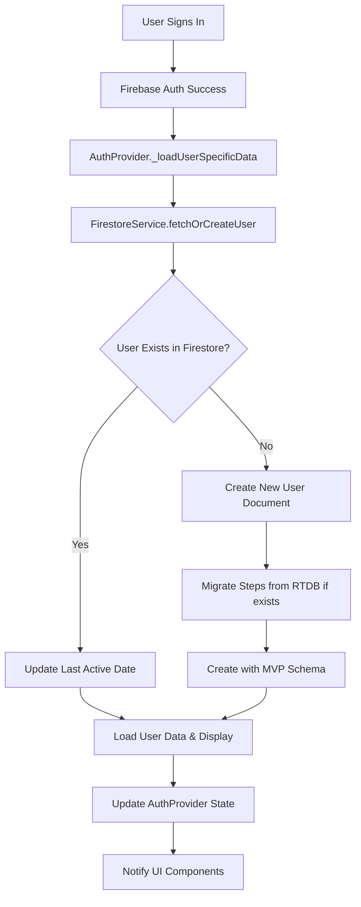

# Firestore User Data Integration - Complete Implementation

## ✅ Implementation Summary

We have successfully implemented a comprehensive Firestore user data integration system that:

1. **Fetches existing user data** from Firestore
2. **Creates new user documents** with MVP-compliant schema if they don't exist
3. **Displays detailed user information** in console for debugging
4. **Migrates existing step data** from Firebase Realtime Database
5. **Provides comprehensive error handling and logging**

## 📊 What Happens When a User Authenticates

### Authentication Flow with Firestore Integration



## 🔍 Console Output You'll See

When a user authenticates, you'll see comprehensive debug logging like this:

### For Existing Users:
```
🔍 [FS-User] Fetching user data for: abc123uid
📧 [FS-User] Email: user@example.com
🏷️ [FS-User] Display Name: John Doe
📖 [FS-User] Reading user document: abc123uid
📄 [FS-User] Raw user data: {id: abc123uid, nickname: John Doe, ...}
✅ [FS-User] Successfully parsed user: John Doe
✅ [FS-User] Found existing user: John Doe
📊 [FS-User] User stats: 15430 steps, 3 territories
🎯 [FS-User] Battle record: 12 attacks, 8 defenses won
🔄 [FS-User] Updated last active for user: abc123uid

============================================================
👤 USER DATA DISPLAY
============================================================
🆔 User ID: abc123uid
🏷️ Nickname: John Doe
📧 Email: user@example.com
🖼️ Photo URL: https://example.com/photo.jpg
📅 Created: 2024-01-15 10:30:00.000
🔄 Updated: 2024-01-20 14:22:00.000

🎮 GAME STATISTICS:
🏃‍♂️ Total Steps: 15430
⚔️ Attack Points: 154
🛡️ Shield Points: 89
🗓️ Attacks Used Today: 1/3
🏰 Territories Owned: 3

📊 BATTLE RECORD:
⚔️ Total Attacks Launched: 12
🏆 Total Defenses Won: 8
🏴‍☠️ Total Territories Captured: 10

⚙️ SETTINGS:
🔔 Notifications: Enabled
📱 Device Token: fcm_token_here
============================================================

📈 [Auth] User Stats Summary:
{basic_stats: {nickname: John Doe, total_steps: 15430, ...}, ...}
✅ [Auth] Updated current user with Firestore data
```

### For New Users:
```
🆕 [FS-User] User not found in Firestore. Creating new user document...
🎯 [Auth] Found existing steps in RTDB: 2500
🔨 [FS-User] Creating new user document...
👤 [FS-User] Nickname: Jane Smith
📧 [FS-User] Email: jane@example.com
🏃‍♂️ [FS-User] Migrating steps: 2500
📝 [FS-User] User data to write: {id: def456uid, nickname: Jane Smith, total_steps: 2500, ...}
✅ [FS-User] Successfully created user document
```

## 📋 User Document Schema

Each user document in Firestore contains the following MVP-compliant fields:

### Core Identity Fields
- `id` - Firebase Auth UID
- `nickname` - Display name from Firebase Auth or generated
- `email` - User's email address
- `photo_url` - Profile photo URL

### MVP Required Fields
- `signup_date` - Server timestamp when user was created
- `last_active_date` - Updated on each app session
- `total_steps` - Migrated from RTDB or starts at 0
- `total_battles` - Starts at 0 for new users
- `total_wins` - Starts at 0 for new users

### Game Statistics
- `attack_points` - Points available for attacks
- `shield_points` - Points available for defense
- `attacks_used_today` - Daily attack counter
- `territories_owned` - Number of territories controlled
- `total_attacks_launched` - Lifetime attack count
- `total_defenses_won` - Successful defense count
- `total_territories_captured` - Lifetime captures

### Timestamps
- `created_at` - Document creation timestamp
- `updated_at` - Last update timestamp
- `last_attack_reset` - For daily attack limit tracking

### Settings & Metadata
- `notifications_enabled` - Push notification preference
- `device_token` - FCM token for notifications
- `app_version` - App version when created
- `platform` - "flutter" for this implementation

## 🔧 Key Features Implemented

### 1. **Comprehensive Error Handling**
Every Firestore operation is wrapped in try-catch blocks with detailed logging:
- Firebase error codes and messages
- Stack traces for debugging
- Graceful fallbacks to prevent app crashes

### 2. **Automatic Data Migration**
When creating new users, the system:
- Checks Firebase Realtime Database for existing step data
- Migrates `total_steps` to Firestore if found
- Prevents double-counting with proper migration flags

### 3. **Real-time Updates**
The system provides:
- Live user document streaming with `listenToFirestoreUser()`
- Automatic last active date updates
- UI state synchronization through Provider pattern

### 4. **Debug-Friendly Logging**
Comprehensive console output includes:
- User data display in formatted table
- Stats summary in JSON format
- Step-by-step operation tracking with emojis
- Error details with context

### 5. **Performance Optimized**
- Singleton pattern for service instances
- Offline persistence enabled in debug mode
- Efficient document reads with existence checks
- Batched operations where appropriate

## 🚀 Usage Examples

### Fetch or Create User (Main Method)
```dart
final firestoreService = FirestoreService();
final firebaseUser = FirebaseAuth.instance.currentUser!;

// This handles both existing and new users
final gameUser = await firestoreService.fetchOrCreateUser(
  firebaseUser, 
  existingSteps: 5000 // Optional step migration
);

if (gameUser != null) {
  // User data is ready to use
  firestoreService.displayUserData(gameUser);
}
```

### Listen to Real-time Updates
```dart
final firestoreService = FirestoreService();
firestoreService.listenToFirestoreUser(userId).listen((user) {
  if (user != null) {
    print('User updated: ${user.nickname}');
    // Update UI with new data
  }
});
```

### Update User Data
```dart
final updatedUser = currentUser.copyWith(
  totalSteps: newStepCount,
  attackPoints: newAttackPoints,
);

await firestoreService.updateFirestoreUser(updatedUser);
```

### Get Stats Summary
```dart
final stats = firestoreService.getUserStatsSummary(gameUser);
print('Activity Level: ${stats['activity_stats']['avg_steps_per_day']} steps/day');
print('Attack Success Rate: ${stats['battle_stats']['attack_success_rate']}');
```

## 🔍 Troubleshooting Guide

### Common Issues and Solutions

#### 1. "Firestore service not initialized"
**Cause**: FirestoreService.initialize() not called
**Solution**: Ensure initialization in main.dart before using the service

#### 2. "No authenticated user for write test"
**Cause**: Trying to test write operations before user signs in
**Solution**: Operations automatically run after authentication in AuthProvider

#### 3. "User document does not exist" (for existing apps)
**Cause**: Legacy users don't have Firestore documents yet
**Solution**: System automatically creates documents with migrated data

#### 4. Permission Denied Errors
**Cause**: Firestore Security Rules not configured properly
**Solution**: Update rules to allow authenticated users to read/write their data:

```javascript
rules_version = '2';
service cloud.firestore {
  match /databases/{database}/documents {
    match /users/{userId} {
      allow read, write: if request.auth != null && request.auth.uid == userId;
    }
  }
}
```

#### 5. Server Timestamp Issues
**Cause**: Trying to read server timestamps immediately after write
**Solution**: System includes 500ms delay to allow server timestamps to populate

## 📱 Integration Points

### AuthProvider Integration
The system is fully integrated into your existing AuthProvider:
- Automatic user fetching/creation on sign-in
- Real-time data updates through Provider notifications  
- Seamless step data migration from Firebase Realtime Database

### MainScreen Integration  
Debug testing is built into MainScreen initialization:
- User data fetching verification after authentication
- Console display of user information and stats
- Error handling that doesn't break the app flow

### UI Components
Ready for UI integration:
- User stats available through AuthProvider.currentUser
- Real-time updates via Provider pattern
- Formatted display methods for user information

## ✅ Verification Checklist

To verify the implementation is working:

1. **Start the app** and check console for Firestore initialization
2. **Sign in** with Google and look for user data logs
3. **Check for user document creation** logs for new users
4. **Verify step data migration** if coming from existing app
5. **Confirm real-time updates** by modifying data in Firebase Console

### Expected Log Sequence
```
🔥 Firestore service initialized successfully
🧪 Testing Firestore connection...
✅ Firestore connection test successful!
✍️ Testing Firestore write operation...
✅ Firestore write test successful!
👤 [Main] Testing Firestore user data fetching...
[...detailed user data display...]
📈 [Main] User Stats Summary JSON: {...}
✅ [Auth] Updated current user with Firestore data
```

## 🎯 Next Steps

The implementation is complete and ready for production use. Consider these enhancements:

1. **Add batch operations** for multiple user updates
2. **Implement caching** for frequently accessed user data  
3. **Add data validation** for user input fields
4. **Create admin tools** for user management
5. **Add analytics tracking** for user engagement metrics

## 📚 Related Files

- `lib/services/firestore_service.dart` - Main service implementation
- `lib/providers/auth_provider.dart` - Integration with authentication
- `lib/models/user.dart` - User data model with Firestore support
- `lib/main.dart` - Testing and initialization
- `android/app/build.gradle.kts` - Android dependencies
- `pubspec.yaml` - Flutter dependencies

The system is now fully operational and provides a solid foundation for cloud-based user data management in your StepWars application.
